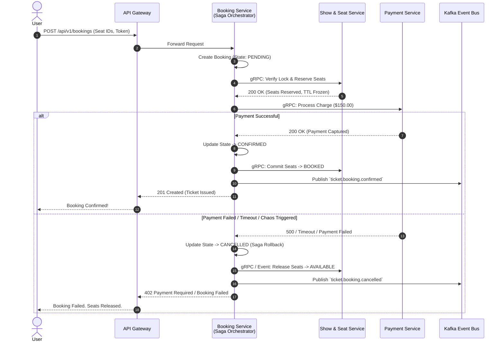
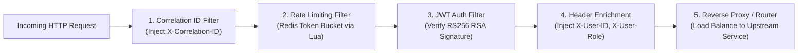
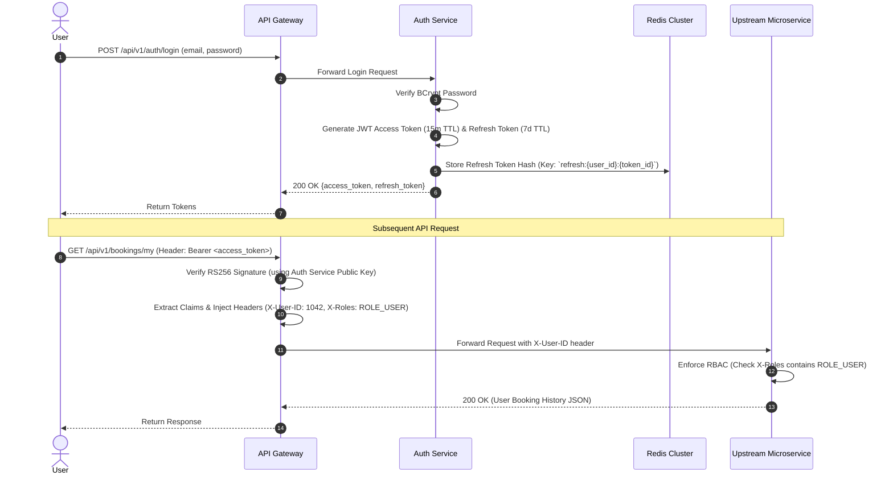
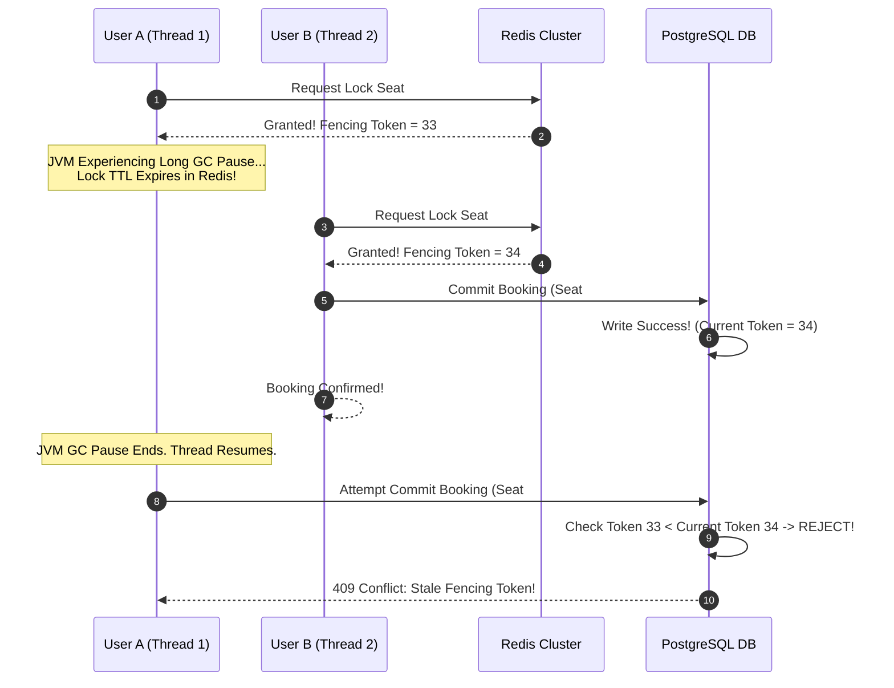
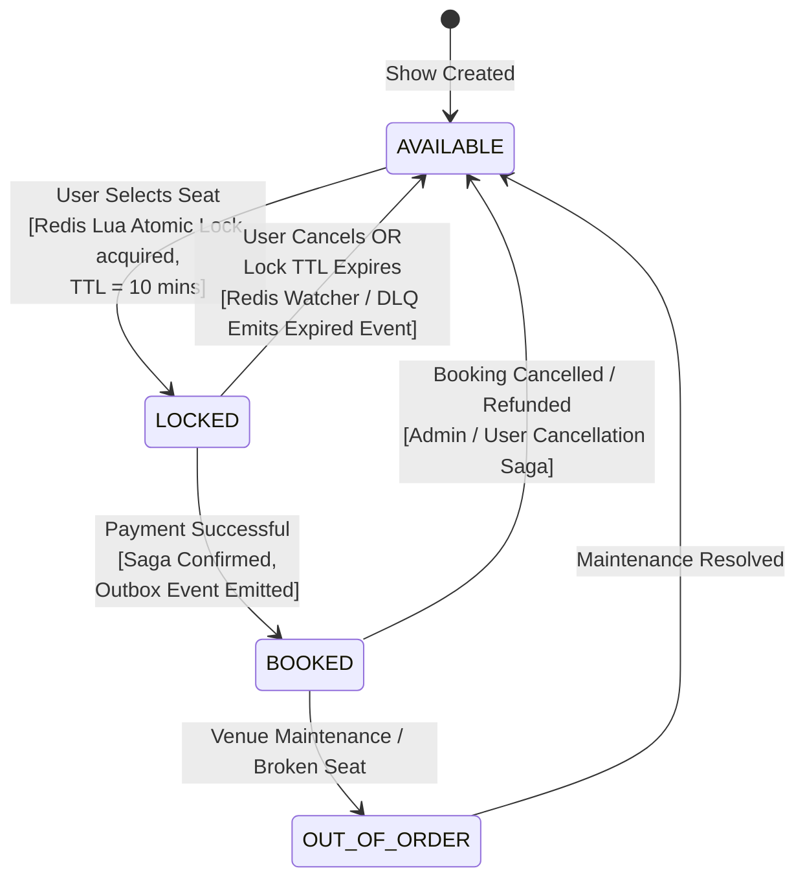
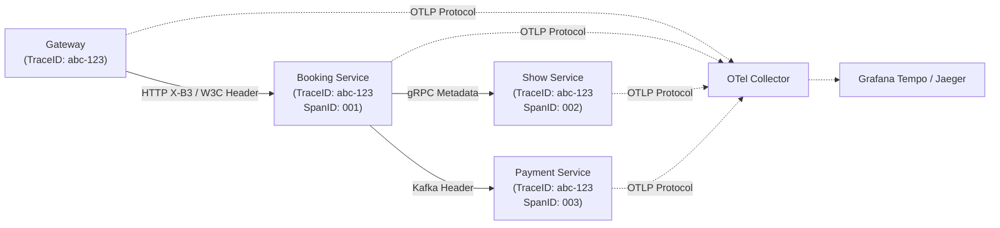

# Distributed Ticket Booking System — Production Architecture & Engineering Specification

**Document Version:** 1.0.0  
**Target Architecture:** Microservices, Event-Driven (Kafka), Polyglot Persistence (PostgreSQL, Redis, OpenSearch)  
**Technology Stack:** Java 21 (Virtual Threads / Project Loom), Spring Boot 3.3+, Spring Cloud, Docker, Kubernetes  
**Target SLAs:** 100,000 Concurrent Active Users | 10,000 Booking RPS | P95 Read Latency < 200ms | Seat Lock Latency < 100ms | **Zero Double Bookings**

---

## Executive Summary & Architectural Philosophy

Building a distributed ticket booking system capable of handling high-concurrency flash sales (such as a stadium concert or sporting championship) requires shifting from traditional CRUD database thinking to **event-driven, state-machine-oriented, and resilience-first architecture**. 

When 100,000 users simultaneously attempt to book 50,000 seats within a 60-second window, traditional database ACID locks (`SELECT ... FOR UPDATE`) collapse under transaction queuing, connection pool exhaustion, and lock contention. 

This architecture solves the flash sale problem by:
1. **Decoupling Reservation from Persistence:** Using atomic in-memory operations in **Redis Cluster (via Lua scripts / Redlock)** as the primary high-speed gatekeeper for seat locking (<100ms latency), while persisting state asynchronously to PostgreSQL using the **Transactional Outbox Pattern**.
2. **Embracing Java 21 Virtual Threads:** Utilizing Project Loom in Spring Boot 3 to handle thousands of concurrent blocking I/O calls without OS thread pool starvation.
3. **Choreographing Distributed Transactions via Sagas:** Managing multi-service booking workflows with an orchestrated Saga pattern in the Booking Service, backed by **Inbox/Outbox tables** for exactly-once processing and **Dead Letter Queues (DLQs)** for poison-pill isolation.
4. **Embedding Chaos & Deep Observability:** Integrating configurable chaos engineering directly into the Payment Service to continuously prove rollback resilience, monitored by end-to-end W3C **OpenTelemetry distributed tracing**.

---

## 1. Functional Requirements

### 1.1 Core User Journeys
* **User Authentication & Management:** Secure registration, login via stateless JWT (with refresh token rotation in Redis), and role-based access control (RBAC: `ROLE_USER`, `ROLE_ADMIN`, `ROLE_ORGANIZER`).
* **Event & Show Discovery:** Browsing events, venues, movies, and concerts with full-text search, filtering by city, date, genre, and language.
* **Interactive Seat Selection:** Viewing real-time seat layouts (available, locked, booked, or out-of-order) grouped by pricing tiers (e.g., VIP, Premium, Standard).
* **Temporary Seat Locking:** Holding selected seats atomically for a strict 10-minute window while the user completes payment.
* **Booking Confirmation:** Issuing cryptographic booking tickets and QR codes upon successful payment receipt.
* **Order Cancellation & Refunds:** Allowing users or administrators to cancel confirmed bookings, releasing seats back to inventory, and triggering automated refund workflows.
* **Notifications:** Dispatching asynchronous booking confirmations, reminder alerts, and refund notices via SMS, Email, and Push Notifications.
* **User History:** Viewing past bookings, active tickets, and downloadable receipts.

### 1.2 Administrative Capabilities
* **Venue & Screen Management:** Defining stadium layouts, seating charts, and pricing zones.
* **Event Publishing:** Scheduling shows, configuring ticket limits per user, and triggering flash sale windows.
* **Analytics & Reporting:** Monitoring live booking velocity, revenue metrics, seat occupancy rates, and payment gateway health.

---

## 2. Non-Functional Requirements & Target SLAs

| Metric / Requirement | Target SLA / Specification | Architectural Enabler |
| :--- | :--- | :--- |
| **Concurrent Active Users** | **100,000 users** actively browsing and selecting seats | Stateless Java 21 Virtual Threads + Redis Cache-Aside + CDN Edge Caching |
| **Booking Throughput** | **10,000 booking requests/sec (RPS)** during flash sales | Redis Atomic Lua Script Locking + Kafka Asynchronous Ingestion |
| **Read Latency (Catalog)** | **P95 < 200ms** for show schedules and search | OpenSearch Full-Text Index + Multi-tier Redis Caching |
| **Seat Lock Latency** | **P95 < 100ms** for atomic seat reservation | Redis In-Memory Bitmaps & Lua Execution |
| **Data Consistency** | **Zero Double Bookings (100% Linearizable for Seats)** | Atomic Redis Check-and-Set + PostgreSQL Unique DB Constraints + Fencing Tokens |
| **System Availability** | **99.99% Uptime** (Max 52.6 minutes downtime/year) | Kubernetes Multi-AZ Deployment + Automated Failover + Circuit Breakers |
| **Disaster Recovery** | **RPO < 1 minute | RTO < 5 minutes** | PostgreSQL Automated WAL Replication & Redis Cluster AOF Persistence |

---

## 3. System Architecture Diagram

```mermaid
graph TB
    subgraph "Client Layer"
        Web["Web Application (React / Next.js)"]
        Mobile["Mobile App (iOS / Android)"]
        Admin["Admin Portal"]
    </subgraph

    subgraph "Edge & Ingress Layer"
        CDN["Cloudflare CDN / DDoS Protection"]
        LB["Kubernetes Ingress / Load Balancer"]
    </subgraph

    subgraph "Gateway Layer"
        GW["Custom API Gateway Service<br/>(Java 21 + Spring Boot 3)<br/>[Rate Limiting | JWT Auth | Routing]"]
    </subgraph

    subgraph "Microservices Ecosystem (Java 21 + Spring Boot 3)"
        Auth["Auth Service"]
        User["User Service"]
        Catalog["Catalog & Event Service"]
        ShowSeat["Show & Seat Service"]
        Booking["Booking Service<br/>(Saga Orchestrator)"]
        Payment["Payment Service<br/>(Chaos Enabled)"]
        Notif["Notification Service"]
        Analytics["Analytics & History Service"]
    </subgraph

    subgraph "Persistence Layer"
        DB_Auth[(PostgreSQL<br/>Auth DB)]
        DB_User[(PostgreSQL<br/>User DB)]
        DB_Show[(PostgreSQL<br/>Show & Seat DB)]
        DB_Book[(PostgreSQL<br/>Booking DB)]
        DB_Pay[(PostgreSQL<br/>Payment DB)]
        
        RedisCluster[("Redis Cluster<br/>[Locks | Cache | Sessions | Rate Limit]")]
        OpenSearch[("OpenSearch<br/>[Full-Text Search & Catalog]")]
    </subgraph

    subgraph "Event Bus & Asynchronous Backbone"
        Kafka[("Apache Kafka Cluster<br/>[Event Bus | Outbox / Inbox | DLQ]")]
    </subgraph

    subgraph "Observability & Telemetry"
        OTEL["OpenTelemetry Collector"]
        Prom["Prometheus & Grafana"]
        ELK["ELK / OpenSearch Log Stack"]
    </subgraph

    %% Routing
    Web & Mobile & Admin --> CDN
    CDN --> LB
    LB --> GW

    %% Gateway to Services
    GW -->|REST/HTTP| Auth
    GW -->|REST/HTTP| User
    GW -->|REST/HTTP| Catalog
    GW -->|REST/HTTP| ShowSeat
    GW -->|REST/HTTP| Booking
    GW -->|REST/HTTP| Analytics

    %% Internal Sync (gRPC)
    Booking -.->|gRPC: Validate & Lock| ShowSeat
    Booking -.->|gRPC: Process Charge| Payment

    %% Persistence connections
    Auth --> DB_Auth
    User --> DB_User
    ShowSeat --> DB_Show & RedisCluster
    Booking --> DB_Book & RedisCluster
    Payment --> DB_Pay
    Catalog --> OpenSearch & RedisCluster
    GW --> RedisCluster

    %% Event Bus Connections
    ShowSeat & Booking & Payment ==>|Publish Outbox Events| Kafka
    Kafka ==>|Consume Inbox Events| Notif & Analytics & ShowSeat & Booking

    %% Observability Streams
    GW & Auth & User & Catalog & ShowSeat & Booking & Payment & Notif & Analytics -.->|W3C Trace Context & Logs| OTEL
    OTEL -.-> Prom & ELK
```

---

## 4. Service Decomposition & Tech Stack

Every microservice is built using **Java 21** and **Spring Boot 3.3+**, leveraging **Project Loom (Virtual Threads)** to ensure that thread-per-request models do not block underlying OS threads during network calls, database queries, or Kafka publishing.

### Why Java 21 + Spring Boot 3 for all services?
* **Virtual Threads:** Enabling `spring.threads.virtual.enabled=true` allows a single Spring Boot container to handle tens of thousands of concurrent I/O-bound requests with near-zero thread context-switching overhead.
* **Standardized Enterprise Patterns:** Uniform ecosystem across all services simplifies dependency management, CI/CD pipelines, observability injection (Micrometer / OpenTelemetry), and security configurations.
* **Type Safety & Maintainability:** Strict domain modeling using Java 21 Records, sealed classes, and pattern matching ensures clean compile-time safety across complex booking state machines.

### Bounded Contexts & Microservice Inventory
1. **API Gateway Service:** Reverse proxy, traffic routing, JWT signature verification, distributed rate limiting, and request correlation ID injection.
2. **Auth Service:** User registration, authentication, RSA JWT token issuance, refresh token lifecycle, and role management.
3. **User Service:** User profile management, saved payment methods tokenization, and user preference management.
4. **Catalog & Event Service:** Event discovery, venue layouts, artist metadata, and open-text search.
5. **Show & Seat Service:** Seating chart inventories, real-time seat availability bitmaps, atomic seat locking, and pricing calculation.
6. **Booking Service (Saga Orchestrator):** Core order creation, booking state machine management, distributed transaction orchestration, and ticket generation.
7. **Payment Service (with Chaos Engineering):** Payment gateway integration (Stripe/Razorpay mocking), transaction ledgering, refund processing, and chaos injection for resilience testing.
8. **Notification & Analytics Service:** Multi-channel notification delivery (Email/SMS/Push), real-time booking analytics ingestion, and audit reporting.

---

## 5. Responsibilities of Every Microservice

| Microservice | Core Domain Responsibilities | Owned Database / Store | Primary Upstream Clients | Primary Downstream Dependencies |
| :--- | :--- | :--- | :--- | :--- |
| **API Gateway** | Route forwarding, SSL termination, Redis Token Bucket rate limiting, JWT validation, W3C Trace header injection. | Redis (Rate Limiting) | External Clients (Web/Mobile) | All Internal Microservices |
| **Auth Service** | User login, password bcrypt hashing, RSA-256 JWT generation, refresh token blacklisting/rotation. | PostgreSQL (`auth_db`), Redis | API Gateway, Internal Services | None |
| **User Service** | Managing user profiles, addresses, contact details, and GDPR/privacy requests. | PostgreSQL (`user_db`) | API Gateway, Booking Service | None |
| **Catalog Service** | Managing event schedules, movies, venues, screens, and serving high-speed search queries. | OpenSearch, Redis (Cache) | API Gateway | None |
| **Show & Seat Service** | Maintaining physical seat layouts, executing atomic Redis Lua seat locks, enforcing fencing tokens, updating seat statuses. | PostgreSQL (`show_db`), Redis | API Gateway, Booking Service (gRPC) | Kafka (Outbox) |
| **Booking Service** | Managing booking lifecycle, orchestrating checkout Sagas, issuing tickets, handling cancellations. | PostgreSQL (`booking_db`), Redis | API Gateway | Show & Seat (gRPC), Payment (gRPC), Kafka |
| **Payment Service** | Executing charges, managing refunds, ledgering transactions, simulating production failures via Chaos Engine. | PostgreSQL (`payment_db`) | Booking Service (gRPC) | Kafka (Outbox / Webhooks) |
| **Notification Service** | Rendering templates, delivering transactional alerts (booking confirmation, OTP, refunds), tracking delivery status. | None (Stateless / Cache only) | Kafka (Event Consumer) | External Providers (SendGrid, Twilio) |
| **Analytics Service** | Aggregating event metrics, calculating real-time revenue, monitoring venue fill rates, feeding admin dashboards. | ClickHouse / PostgreSQL (`analytics_db`) | Kafka (Event Consumer) | None |

---

## 6. Polyglot Persistence & Database per Service

To prevent database coupling and schema contention, each service strictly owns its persistent store. **No microservice is allowed to query another microservice's database directly.**

### 6.1 PostgreSQL (Relational Transactional Engine)
Used by **Auth, User, Show & Seat, Booking, and Payment** services.
* **Why PostgreSQL?** Provides robust ACID compliance, serializable transaction isolation, strict schema enforcement, and JSONB support for flexible metadata.
* **Isolation Strategy:** Each service connects to an independent database schema (e.g., `show_service_schema`) on a managed PostgreSQL cluster with physical Read Replicas for scaling query read traffic.

### 6.2 Redis Cluster (In-Memory Data Grid)
Used by **Gateway, Show & Seat, Booking, and Catalog** services.
* **Distributed Locking:** Uses Redlock / Lua scripts for atomic 10-minute seat reservations.
* **Real-Time Seat Availability Bitmaps:** Storing seating layouts in Redis Bitsets where each bit represents a seat (`0` = Available, `1` = Locked/Booked), enabling O(1) availability checks and sub-millisecond full-screen renderings.
* **Token Bucket Rate Limiting:** Tracking IP/User request counts at the Gateway.
* **Session & Token Store:** Storing active refresh tokens and user session state.

### 6.3 OpenSearch (Full-Text & Analytical Engine)
Used by the **Catalog Service** and central **Logging Stack**.
* **Why OpenSearch?** Relational databases degrade when performing wildcard searches across millions of event titles, descriptions, cast names, and venue cities. OpenSearch provides inverted indexing, fuzzy matching, and geo-spatial search for rapid event discovery (P95 < 50ms).

---

## 7. Event-Driven Communication & Kafka Architecture

All asynchronous state mutations, notifications, and analytics ingestions are decoupled using **Apache Kafka** as the central nervous system.

### 7.1 Kafka Topic Inventory & Partitioning Strategy

| Topic Name | Partition Key | Replication Factor | Retention | Description |
| :--- | :--- | :--- | :--- | :--- |
| `ticket.seat.locked` | `show_id` | 3 (min ISR=2) | 24 Hours | Emitted when seats are temporarily reserved in Redis. |
| `ticket.seat.unlocked` | `show_id` | 3 (min ISR=2) | 24 Hours | Emitted when lock TTL expires or user cancels checkout. |
| `ticket.booking.created` | `booking_id` | 3 (min ISR=2) | 7 Days | Emitted when Booking Service initiates a checkout Saga. |
| `ticket.payment.requested` | `booking_id` | 3 (min ISR=2) | 7 Days | Instructs Payment Service to execute a charge. |
| `ticket.payment.completed` | `booking_id` | 3 (min ISR=2) | 30 Days | Emitted upon successful payment capture. |
| `ticket.payment.failed` | `booking_id` | 3 (min ISR=2) | 30 Days | Emitted when charge fails or times out; triggers Saga rollback. |
| `ticket.booking.confirmed` | `booking_id` | 3 (min ISR=2) | 30 Days | Final ticket issuance event; consumed by Notification and Analytics. |
| `ticket.booking.cancelled` | `booking_id` | 3 (min ISR=2) | 30 Days | Emitted when an order is cancelled; triggers seat release and refund. |
| `ticket.notification.send` | `user_id` | 3 (min ISR=2) | 7 Days | Generic asynchronous notification dispatch payload. |

> [!IMPORTANT]
> **Partition Keying by `show_id` for Seat Ordering**  
> All seat-related events (`locked`, `unlocked`, `booked`) MUST be partitioned by `show_id`. This guarantees that all state transitions for a specific show are processed sequentially by the exact same Kafka consumer thread, eliminating out-of-order race conditions while allowing horizontal scaling across different shows.

### 7.2 Producer & Consumer Reliability Configs
* **Producers (Outbox Relay):** Configured with `acks=all`, `enable.idempotence=true`, and `retries=INT_MAX`. This ensures zero message loss and prevents duplicate messages from being appended to Kafka logs during network retries.
* **Consumers:** Configured with `enable.auto.commit=false`. Offsets are committed manually only *after* local database transactions (or Inbox insertions) succeed.

---

## 8. 10 Core Production Resiliency Patterns

To survive hardware failures, network splits, and flash-sale thundering herds, all services must implement the following 10 production patterns:

### 1. Saga Pattern (Orchestrated)
Managing distributed transactions across multiple microservices without long-running 2PC (Two-Phase Commit) database locks.
* **Implementation:** The **Booking Service** acts as the Saga Orchestrator. When a user checks out:
  1. Booking Service creates booking in `PENDING` state and emits `BookingCreated`.
  2. Booking Service invokes Show & Seat Service (via gRPC) to verify lock ownership and transition seat state to `RESERVED`.
  3. Booking Service invokes Payment Service (via gRPC/Kafka) to charge user.
  4. **Success Path:** If Payment succeeds, Booking Service updates state to `CONFIRMED`, emits `BookingConfirmed`, and instructs Show Service to commit seats to `BOOKED`.
  5. **Compensating Rollback Path:** If Payment fails or times out, Booking Service executes compensating transactions: emitting `BookingCancelled`, instructing Show Service to release seat locks back to `AVAILABLE`, and initiating refunds if partial funds were captured.



### 2. Transactional Outbox Pattern
Preventing dual-write inconsistencies where a database transaction succeeds but the subsequent Kafka network publish fails (or vice versa).
* **Implementation:** When the Show Service locks a seat, it writes the state change to the `seats` table AND writes the Kafka event payload to a local `outbox_events` table within the **exact same ACID PostgreSQL transaction**. A background polling thread (or Debezium CDC engine) tails the `outbox_events` table and publishes pending events to Kafka, deleting or marking them as sent upon acknowledgment.

### 3. Inbox Pattern (Idempotency & Deduplication)
Preventing duplicate processing when Kafka consumer retries or payment webhooks deliver the same message multiple times (At-Least-Once delivery).
* **Implementation:** Every incoming event contains a unique `event_id` (or `Idempotency-Key` header for APIs). Consumer microservices check an `inbox_messages` PostgreSQL table before processing:
  ```sql
  INSERT INTO inbox_messages (event_id, consumer_group, processed_at) 
  VALUES ('evt_12345', 'notification_group', NOW()) 
  ON CONFLICT (event_id, consumer_group) DO NOTHING;
  ```
  If the insert returns 0 rows affected, the message is a duplicate and is acknowledged immediately without executing business logic.

### 4. Circuit Breaker Pattern
Preventing cascading failures when a downstream dependency (e.g., Payment Gateway or Catalog DB) becomes slow or unresponsive.
* **Implementation:** Built using **Resilience4j** around all outbound HTTP/REST and gRPC calls.
* **Configuration:**
  * `slidingWindowSize`: 100 requests.
  * `failureRateThreshold`: 50% (opens circuit if half of requests fail).
  * `slowCallRateThreshold`: 75% (opens circuit if 75% of requests exceed 300ms).
  * `waitDurationInOpenState`: 10 seconds before transitioning to Half-Open to test recovery.
  * **Fallback Method:** When Catalog Search circuit opens, the service returns cached top-10 trending shows from Redis instead of throwing a 500 error.

### 5. Retry with Exponential Backoff + Jitter
Handling transient network blips and database deadlocks gracefully without hammering struggling services.
* **Implementation:** Configured via Spring Retry / Resilience4j.
* **Formula:** $T_{sleep} = \min(T_{max}, T_{initial} \times 2^{attempt}) + \text{RandomJitter}(0, 100\text{ms})$.
* **Rules:** Maximum 3 retry attempts for network/IO timeouts. NEVER retry 4xx client errors (e.g., 400 Bad Request, 401 Unauthorized, 409 Conflict).

### 6. Dead Letter Queue (DLQ)
Isolating "poison pill" messages (malformed JSON, unrecoverable domain exceptions) that fail processing after maximum retry attempts.
* **Implementation:** If a Kafka consumer fails to process a message 3 times, Spring Kafka error handlers route the raw payload and stack trace headers to `<original_topic>.dlq`. Automated alerts notify engineering teams, while consumer threads continue processing subsequent messages without blocking partition progress.

### 7. Bulkhead Pattern
Isolating system resources so that saturation in one feature area does not consume threads needed for other critical functions.
* **Implementation:** In the Booking Service, thread pools and connection pools are isolated into distinct Bulkheads via Resilience4j:
  * `payment-execution-pool`: Max 20 concurrent threads. If Payment gateway hangs, only these 20 threads block.
  * `seat-validation-pool`: Max 50 concurrent threads.
  * Even during a payment gateway outage, seat browsing and catalog queries remain 100% responsive.

### 8. Health Checks (Liveness & Readiness)
Enabling Kubernetes to detect frozen JVMs, deadlocks, or database connectivity losses and self-heal automatically.
* **Implementation:** Integrated via Spring Boot Actuator:
  * `/actuator/health/liveness`: Returns `200 OK` as long as the JVM process is running and not deadlocked. If it returns 503, Kubernetes kills and restarts the pod.
  * `/actuator/health/readiness`: Checks connectivity to local PostgreSQL, Redis, and Kafka brokers. If a database failover occurs, readiness returns 503, causing Kubernetes Load Balancers to temporarily remove the pod from routing until connectivity restores.

### 9. Graceful Shutdown
Ensuring zero dropped requests or corrupted database transactions during automated Kubernetes deployments or pod scaling events.
* **Implementation:**
  * Spring Boot configuration: `server.shutdown=graceful` and `spring.lifecycle.timeout-per-shutdown-phase=30s`.
  * Kubernetes Pod lifecycle hook:
    ```yaml
    lifecycle:
      preStop:
        exec:
          command: ["sh", "-c", "sleep 10"]
    ```
  * When `SIGTERM` is received, the service immediately fails readiness checks (stop taking new traffic), allows 20 seconds for in-flight requests and database transactions to finish, and cleanly closes HikariCP and Kafka connections before exiting.

### 10. API Versioning
Guaranteeing backward compatibility for mobile apps and third-party consumers as domain schemas evolve.
* **Implementation:** Explicit URI Path Versioning for all external REST endpoints: `/api/v1/shows/{id}`, `/api/v2/bookings`.
* Breaking changes (e.g., splitting a `name` field into `first_name` and `last_name`) must be published under a new version major (`/v2/`), maintaining support for `/v1/` for a minimum 90-day deprecation window.

---

## 9. Custom API Gateway Architecture

To deeply understand routing mechanics, JWT termination, and token-bucket algorithms, Milestone 1 implements a **Custom API Gateway Service** using Java 21, Spring Boot 3, and Spring Cloud Gateway / Netty reactive principles.



### 9.1 Filter Chain Execution Pipeline
1. **Correlation ID Injection Filter:** Checks for existing `X-Correlation-ID` header. If absent, generates a UUIDv4 string and attaches it to the request scope and MDC (Mapped Diagnostic Context) for distributed logging.
2. **Distributed Rate Limiting Filter (Redis Token Bucket):**
   * Executes an atomic Redis Lua script evaluating IP address and User ID against a Token Bucket algorithm.
   * Standard Rate: 20 requests / second per user. Flash Sale Endpoint (`/api/v1/shows/{id}/seats/lock`): 5 requests / second per user.
   * If bucket is empty, rejects request immediately with HTTP `429 Too Many Requests` and header `Retry-After: 1`.
3. **JWT Authentication & Termination Filter:**
   * Intercepts `Authorization: Bearer <token>` headers.
   * Verifies RS256 cryptographic signature against cached public keys retrieved from the Auth Service JWKS endpoint (`/.well-known/jwks.json`).
   * Validates token expiration (`exp`) and issuer (`iss`).
   * **Security Boundary:** Strips raw JWT from upstream requests and injects trusted internal headers: `X-User-ID`, `X-User-Roles`, and `X-Auth-Time`. Upstream microservices never expend CPU cycles parsing JWTs; they implicitly trust gateway headers over private Kubernetes network mesh.
4. **Dynamic Routing & Load Balancing Filter:** Maps path prefixes to internal Kubernetes service DNS names (e.g., `/api/v1/shows/**` -> `http://show-service.default.svc.cluster.local:8080`).

---

## 10. Authentication & Authorization Flow



* **Access Token:** Short-lived (15 minutes), stateless JSON Web Token signed with Asymmetric RS256 private key. Contains user ID, roles, and email.
* **Refresh Token:** Long-lived (7 days), cryptographically secure random string stored in Redis and returned in an HTTP-Only, Secure cookie.
* **Revocation Strategy:** When a user logs out or changes password, their active Refresh Token is deleted from Redis, and their `user_id` is appended to a Redis JWT Blacklist (`blacklist:{token_jti}`) with a TTL matching the remaining lifespan of their short-lived access token.

---

## 11. Redis Usage Strategy

Redis is the high-speed workhorse of this architecture, utilized across 5 distinct operational patterns:

| Pattern / Usage | Redis Data Structure | Key Naming Convention | TTL | Description |
| :--- | :--- | :--- | :--- | :--- |
| **Distributed Seat Locks** | String (Redlock / Lua) | `lock:show:{show_id}:seat:{seat_id}` | 600s (10m) | Stores `user_id` + fencing token. Prevents concurrent selection. |
| **Real-Time Seat Bitmaps** | Bitmap (Bitset) | `show:{show_id}:bitmap:status` | Show End + 24h | Bit offset = `seat_id`. Value `0` = Available, `1` = Unavailable. |
| **Rate Limiting Buckets** | Hash / String | `ratelimit:{endpoint}:{user_ip}` | 60s | Token bucket counter evaluated via Lua scripts. |
| **Catalog Query Cache** | String (JSONB / Snappy) | `cache:show:{show_id}:details` | 3600s (1h) | Caches static venue details, pricing tiers, and show times. |
| **Idempotency Keys** | String | `idempotency:booking:{key}` | 86400s (24h) | Stores response hash of processed requests to prevent duplicate charges. |

---

## 12. Distributed Locking Strategy (Flash Sale Concurrency Control)

The most critical engineering failure mode in ticket booking occurs when two users click the exact same seat simultaneously during a flash sale. If both requests reach PostgreSQL simultaneously, row-level locking contention will paralyze the database.

### 12.1 Atomic Redis Lua Script (The Primary Gatekeeper)
When a user requests to lock seats, the Show Service executes an **atomic Lua script** on Redis. Because Redis executes scripts single-threadedly and atomically, race conditions are mathematically impossible.

```lua
-- KEYS[1] = lock key (e.g., lock:show:101:seat:55)
-- KEYS[2] = bitmap key (e.g., show:101:bitmap:status)
-- ARGV[1] = user_id
-- ARGV[2] = TTL in seconds (600)
-- ARGV[3] = seat bit offset (55)

-- 1. Check if seat is already locked or booked in bitmap
local is_taken = redis.call('GETBIT', KEYS[2], ARGV[3])
if is_taken == 1 then
    return -1 -- Error: Seat is already taken
end

-- 2. Check if a string lock already exists
if redis.call('EXISTS', KEYS[1]) == 1 then
    return -1 -- Error: Seat is already locked
end

-- 3. Acquire lock and update bitmap atomically
redis.call('SET', KEYS[1], ARGV[1], 'EX', ARGV[2])
redis.call('SETBIT', KEYS[2], ARGV[3], 1)

return 1 -- Success: Lock acquired
```

### 12.2 Lock Fencing Tokens
To protect against arbitrary process pauses (e.g., JVM Garbage Collection pauses where a lock expires in Redis while the thread is asleep, leading to another user acquiring the lock), every successful lock acquisition generates a **monotonically increasing Fencing Token** (`INCR fencing:counter:show:{show_id}`). 

When the Booking Service instructs PostgreSQL to finalize a booking, it passes this Fencing Token. The database table enforces a check that the incoming token is strictly greater than the last committed token for that seat, rejecting any stale updates from resurrected threads.



---

## 13. Seat Booking Algorithm & State Machine

Every seat in a show schedule transitions through a rigorous, finite state machine:



### 13.1 Detailed Booking Step-by-Step Algorithm
1. **Selection:** User clicks seats `{A1, A2}` on interactive map. Client calls `POST /api/v1/shows/{id}/locks`.
2. **Atomic Reservation:** Gateway routes to Show & Seat Service. Service executes Redis Lua script. If SUCCESS, generates reservation ID, returns Fencing Token, and starts 10-minute countdown. Emits `ticket.seat.locked` to Kafka.
3. **Checkout Initiation:** User submits payment details. Client calls `POST /api/v1/bookings` with reservation token.
4. **Saga Orchestration:** Booking Service creates record in `PENDING` state, validates reservation token with Show Service via gRPC, and invokes Payment Service.
5. **Payment Capture:** Payment Service executes charge. If SUCCESS, emits `ticket.payment.completed`.
6. **State Commitment:** Booking Service consumes completion event, updates status to `CONFIRMED`, and calls Show Service via gRPC to transition seat DB rows from `LOCKED` to `BOOKED`.
7. **Cleanup:** Show Service deletes Redis TTL lock key (since DB state is now permanently committed as booked).

---

## 14. Database Schema Overview

### 14.1 Show & Seat Service Schema (`show_db`)

```sql
CREATE TABLE venues (
    venue_id BIGSERIAL PRIMARY KEY,
    name VARCHAR(255) NOT NULL,
    city VARCHAR(100) NOT NULL,
    address TEXT NOT NULL,
    created_at TIMESTAMP WITH TIME ZONE DEFAULT NOW()
);

CREATE TABLE screens (
    screen_id BIGSERIAL PRIMARY KEY,
    venue_id BIGINT REFERENCES venues(venue_id),
    name VARCHAR(100) NOT NULL,
    total_seats INT NOT NULL
);

CREATE TABLE seats (
    seat_id BIGSERIAL PRIMARY KEY,
    screen_id BIGINT REFERENCES screens(screen_id),
    row_label VARCHAR(10) NOT NULL,
    seat_number INT NOT NULL,
    tier_name VARCHAR(50) NOT NULL, -- 'VIP', 'PREMIUM', 'STANDARD'
    UNIQUE(screen_id, row_label, seat_number)
);

CREATE TABLE shows (
    show_id BIGSERIAL PRIMARY KEY,
    event_id BIGINT NOT NULL, -- Reference to Catalog Service
    screen_id BIGINT REFERENCES screens(screen_id),
    start_time TIMESTAMP WITH TIME ZONE NOT NULL,
    end_time TIMESTAMP WITH TIME ZONE NOT NULL,
    status VARCHAR(50) DEFAULT 'SCHEDULED' -- 'SCHEDULED', 'ACTIVE', 'CANCELLED'
);

CREATE TABLE show_seats (
    show_seat_id BIGSERIAL PRIMARY KEY,
    show_id BIGINT REFERENCES shows(show_id),
    seat_id BIGINT REFERENCES seats(seat_id),
    price DECIMAL(10, 2) NOT NULL,
    status VARCHAR(30) DEFAULT 'AVAILABLE', -- 'AVAILABLE', 'LOCKED', 'BOOKED', 'OUT_OF_ORDER'
    reserved_by_user_id BIGINT NULL,
    lock_expires_at TIMESTAMP WITH TIME ZONE NULL,
    fencing_token BIGINT DEFAULT 0,
    version BIGINT DEFAULT 0, -- Optimistic locking version
    UNIQUE(show_id, seat_id)
);

CREATE INDEX idx_show_seats_status ON show_seats(show_id, status);
CREATE INDEX idx_show_seats_expiration ON show_seats(lock_expires_at) WHERE status = 'LOCKED';
```

### 14.2 Booking Service Schema (`booking_db`)

```sql
CREATE TABLE bookings (
    booking_id VARCHAR(64) PRIMARY KEY, -- UUID / NanoID
    user_id BIGINT NOT NULL,
    show_id BIGINT NOT NULL,
    total_amount DECIMAL(10, 2) NOT NULL,
    status VARCHAR(50) NOT NULL, -- 'PENDING', 'CONFIRMED', 'CANCELLED', 'EXPIRED'
    idempotency_key VARCHAR(128) UNIQUE NOT NULL,
    created_at TIMESTAMP WITH TIME ZONE DEFAULT NOW(),
    updated_at TIMESTAMP WITH TIME ZONE DEFAULT NOW()
);

CREATE TABLE booking_items (
    item_id BIGSERIAL PRIMARY KEY,
    booking_id VARCHAR(64) REFERENCES bookings(booking_id),
    show_seat_id BIGINT NOT NULL,
    seat_label VARCHAR(20) NOT NULL,
    price DECIMAL(10, 2) NOT NULL
);

-- Transactional Outbox Table
CREATE TABLE outbox_events (
    event_id UUID PRIMARY KEY,
    aggregate_type VARCHAR(100) NOT NULL, -- 'BOOKING', 'SEAT'
    aggregate_id VARCHAR(100) NOT NULL,
    event_type VARCHAR(100) NOT NULL, -- 'ticket.booking.created'
    payload JSONB NOT NULL,
    created_at TIMESTAMP WITH TIME ZONE DEFAULT NOW(),
    processed BOOLEAN DEFAULT FALSE
);

CREATE INDEX idx_outbox_unprocessed ON outbox_events(created_at) WHERE processed = FALSE;

-- Inbox Deduplication Table
CREATE TABLE inbox_messages (
    event_id UUID NOT NULL,
    consumer_group VARCHAR(100) NOT NULL,
    processed_at TIMESTAMP WITH TIME ZONE DEFAULT NOW(),
    PRIMARY KEY (event_id, consumer_group)
);
```

---

## 15. High-Level API Specifications

### 15.1 External REST APIs (Client to Gateway)

#### 1. Lock Seats for Show
* **Endpoint:** `POST /api/v1/shows/{showId}/locks`
* **Headers:** `Authorization: Bearer <jwt_token>`, `Idempotency-Key: <uuid>`
* **Request Body:**
  ```json
  {
    "seatIds": [551, 552],
    "tier": "VIP"
  }
  ```
* **Response:** `201 Created`
  ```json
  {
    "reservationToken": "res_88192a7c",
    "showId": 101,
    "lockedSeats": [
      {"seatId": 551, "row": "A", "number": 1, "price": 150.00},
      {"seatId": 552, "row": "A", "number": 2, "price": 150.00}
    ],
    "expiresAt": "2026-07-26T20:15:00Z",
    "fencingToken": 34
  }
  ```

#### 2. Create Booking & Initiate Checkout
* **Endpoint:** `POST /api/v1/bookings`
* **Headers:** `Authorization: Bearer <jwt_token>`, `Idempotency-Key: <uuid>`
* **Request Body:**
  ```json
  {
    "reservationToken": "res_88192a7c",
    "showId": 101,
    "paymentMethodId": "pm_mock_stripe_card_valid",
    "fencingToken": 34
  }
  ```
* **Response:** `202 Accepted` (Saga processing initiated asynchronously)
  ```json
  {
    "bookingId": "bk_9920184710",
    "status": "PENDING",
    "totalAmount": 300.00,
    "statusUrl": "/api/v1/bookings/bk_9920184710/status"
  }
  ```

### 15.2 Internal gRPC Service Contracts (High-Throughput Sync)

```protobuf
syntax = "proto3";
package ticket.booking.v1;

service SeatReservationService {
    rpc ValidateAndReserveSeats (ReserveSeatsRequest) returns (ReserveSeatsResponse);
    rpc CommitSeatBookings (CommitSeatsRequest) returns (CommitSeatsResponse);
    rpc ReleaseSeatLocks (ReleaseSeatsRequest) returns (ReleaseSeatsResponse);
}

message ReserveSeatsRequest {
    int64 show_id = 1;
    repeated int64 seat_ids = 2;
    int64 user_id = 3;
    string reservation_token = 4;
}

message ReserveSeatsResponse {
    bool success = 1;
    string error_message = 2;
    int64 fencing_token = 3;
}

message CommitSeatsRequest {
    int64 show_id = 1;
    repeated int64 seat_ids = 2;
    string booking_id = 3;
    int64 fencing_token = 4;
}

message CommitSeatsResponse {
    bool success = 1;
    int64 committed_count = 2;
}
```

---

## 16. OpenTelemetry & Distributed Tracing

To debug latency spikes and trace multi-service Sagas across concurrent Virtual Threads, all microservices are instrumented with **OpenTelemetry (OTel) Java Agent**.



### 16.1 Correlation ID & Trace Propagation
* **W3C Trace Context Standard:** Every HTTP/REST request injects `traceparent: 00-4bf92f3577b34da6a3ce929d0e0e4736-00f067aa0ba902b7-01` header.
* **MDC Integration:** Logback is configured to append `[%X{traceId}, %X{spanId}, %X{correlationId}]` to every structured JSON log line emitted to OpenSearch.
* **Kafka Event Propagation:** When publishing Outbox events, the active OTel Span Context is serialized into Kafka Message Headers (`header.add("traceparent", ...)`), allowing downstream consumer threads in Notification or Analytics services to stitch together end-to-end distributed flame graphs.

---

## 17. Chaos Engineering in Mock Payment Service

To prove our Saga compensating rollbacks and Inbox deduplication algorithms without risking real money, the **Payment Service** contains an embedded, dynamically configurable **Chaos Engine**.

### 17.1 Chaos Modes & Configuration
Configurable via Spring Boot Actuator endpoint `POST /actuator/chaos` or application properties:

```yaml
chaos:
  engine:
    enabled: true
    latency:
      enabled: true
      min-ms: 3000
      max-ms: 12000          # Simulates payment gateway timeouts (> 10s circuit breaker threshold)
      probability: 0.15       # 15% of requests experience massive latency
    failure:
      enabled: true
      rate: 0.10              # 10% of charges fail with HTTP 402 Card Declined / 502 Gateway Error
    duplicate-webhook:
      enabled: true
      rate: 0.05              # 5% of successful charges emit duplicate Kafka webhook events (tests Inbox pattern)
    random-crash:
      enabled: true
      probability: 0.01       # 1% chance the JVM calls System.exit(-1) mid-transaction (tests K8s recovery & Saga WAL)
```

### 17.2 Verification Scenarios Using Chaos Engine
During testing and verification phases, we will enable chaos modes and assert that:
1. When latency exceeds 10 seconds, Resilience4j circuit breakers open in Booking Service, gracefully rolling back seat reservations.
2. When duplicate webhooks fire, the Inbox pattern table drops the second message, preventing double ticketing or duplicate receipts.
3. When the Payment Service JVM crashes mid-charge, Kubernetes restarts the pod, and Kafka consumer group rebalancing resumes unacknowledged messages without data corruption.

---

## 18. Scalability, Caching & Performance Optimization

### 18.1 Preventing Cache Stampede (Thundering Herd)
During flash sales, when the cached catalog details for a popular show expire, 10,000 concurrent threads might simultaneously query PostgreSQL to repopulate the cache, melting the database.

* **Mitigation 1: Mutex Locking via Redis (`SETNX`)**  
  When a cache miss occurs on `cache:show:101:details`, only ONE thread is allowed to query PostgreSQL. It acquires a short-lived Redis lock (`SETNX lock:cache:show:101 1 EX 5`). All other concurrent threads sleep for 50ms and retry reading from the cache.
* **Mitigation 2: Probabilistic Early Expiration (XFetch Algorithm)**  
  Cache items are assigned a logical TTL (e.g., 3600s) but are refreshed *before* actual physical expiration based on concurrent load. As the item approaches expiration, a randomized background worker proactively refreshes the DB query asynchronously, ensuring users never experience a cache miss.

### 18.2 Horizontal Scaling Strategy
* **Stateless Application Tier:** All Java 21 Spring Boot services store zero local session state. Kubernetes Horizontal Pod Autoscaling (HPA) automatically scales pod replicas from 3 to 50 based on:
  * CPU utilization > 70%.
  * Kafka consumer lag > 1,000 messages behind.
* **Database Scaling:** PostgreSQL uses connection pooling via **HikariCP** (max 20 connections per pod) and routes all `SELECT` queries to Read Replicas using Spring AbstractRoutingDataSource.

---

## 19. Security Considerations

* **PCI-DSS Tokenization:** The system NEVER ingests or stores raw credit card numbers or CVV codes. All payment forms are embedded via secure client-side iframes (mocking Stripe Elements), exchanging card data for a one-time cryptographic token (`pm_12345`) before reaching our backend.
* **SQL Injection & XSS Defense:** All database queries utilize Spring Data JPA / Hibernate parameterized PreparedStatement strings. API Gateway sanitizes input payloads and enforces strict CORS policies.
* **Mutual TLS (mTLS):** Within the Kubernetes cluster, all service-to-service gRPC and REST communication is encrypted in-transit using automated mTLS certificate rotation (via Istio Service Mesh or Spring Cloud Security).
* **PII Encryption at Rest:** Sensitive user data (phone numbers, physical addresses) in `user_db` is encrypted at rest using AES-256-GCM column-level encryption via Hibernate `@ColumnTransformer` and Vault-managed encryption keys.

---

## 20. Folder Structure & Clean Hexagonal Architecture

Every microservice strictly adheres to **Hexagonal / Clean Architecture** principles, enforcing absolute separation between core business domain logic and external infrastructure frameworks.

```text
ticket-booking-service/
├── Dockerfile
├── pom.xml                                 # Java 21 / Spring Boot 3 dependencies
└── src/
    ├── main/
    │   ├── java/com/ticketbooking/booking/
    │   │   ├── BookingServiceApplication.java
    │   │   │
    │   │   ├── domain/                     # CORE DOMAIN (Zero Spring/DB Framework Dependencies)
    │   │   │   ├── model/
    │   │   │   │   ├── Booking.java        # Aggregate Root (Java 21 Record / Sealed Class)
    │   │   │   │   ├── BookingId.java      # Strongly typed Value Object
    │   │   │   │   ├── BookingStatus.java  # Enum: PENDING, CONFIRMED, CANCELLED
    │   │   │   │   └── SeatItem.java       # Entity
    │   │   │   ├── exception/
    │   │   │   │   ├── BookingNotFoundException.java
    │   │   │   │   └── SeatAlreadyBookedException.java
    │   │   │   └── repository/
    │   │   │       └── BookingRepository.java # Domain Interface (Port)
    │   │   │
    │   │   ├── application/                # APPLICATION USE CASES (Orchestrates Domain)
    │   │   │   ├── saga/
    │   │   │   │   ├── CheckoutSagaOrchestrator.java
    │   │   │   │   └── step/
    │   │   │   │       ├── ReserveSeatStep.java
    │   │   │   │       └── ProcessPaymentStep.java
    │   │   │   ├── service/
    │   │   │   │   └── CreateBookingUseCase.java
    │   │   │   └── dto/
    │   │   │       ├── CreateBookingRequest.java
    │   │   │       └── BookingResponse.java
    │   │   │
    │   │   ├── infrastructure/             # INFRASTRUCTURE ADAPTERS (Driven Ports)
    │   │   │   ├── persistence/
    │   │   │   │   ├── JpaBookingRepositoryAdapter.java # Implements domain BookingRepository
    │   │   │   │   ├── entity/
    │   │   │   │   │   └── BookingJpaEntity.java        # Hibernate DB Entity
    │   │   │   │   └── outbox/
    │   │   │   │       ├── OutboxEventPublisher.java
    │   │   │   │       └── OutboxJpaEntity.java
    │   │   │   ├── messaging/
    │   │   │   │   ├── KafkaEventProducer.java
    │   │   │   │   └── KafkaInboxConsumer.java
    │   │   │   └── grpc/
    │   │   │       ├── ShowServiceClientAdapter.java    # gRPC Client to Show Service
    │   │   │       └── PaymentServiceClientAdapter.java
    │   │   │
    │   │   └── interfaces/                 # PRIMARY ADAPTERS (Driving Ports)
    │   │       ├── rest/
    │   │       │   ├── BookingController.java           # Spring REST API Controller
    │   │       │   └── GlobalExceptionHandler.java
    │   │       └── event/
    │   │           └── PaymentCompletedListener.java    # Kafka Consumer Endpoint
    │   │
    │   └── resources/
    │       ├── application.yml             # Core config (Project Loom enabled)
    │       ├── application-docker.yml      # Docker Compose environment variables
    │       └── db/migration/
    │           └── V1__init_booking_schema.sql          # Flyway / Liquibase migrations
    │
    └── test/                               # COMPREHENSIVE TEST SUITE
        └── java/com/ticketbooking/booking/
            ├── domain/
            │   └── BookingStateMachineTest.java         # Pure unit tests (no Spring context)
            └── infrastructure/
                └── BookingIntegrationTest.java          # Testcontainers (Postgres + Kafka + Redis)
```

---

## 21. Development Roadmap (Milestones MVP to Production)

We will build and verify this system incrementally. **Every milestone is independently bootable, testable, and verifiable via Docker Compose before advancing.**

### Milestone 1: Foundation, Infrastructure & Custom API Gateway
* Set up local Docker Compose ecosystem: PostgreSQL clusters, Redis Cluster, Kafka + Zookeeper/Kraft, OpenTelemetry Collector, Prometheus, and Grafana.
* Build the **Custom API Gateway Service** in Java 21 + Spring Boot 3.
* Implement Correlation ID generation, Redis Token Bucket rate-limiting Lua script, and reverse proxy routing.
* **Verification:** Verify gateway rejects burst traffic with HTTP 429 and correctly proxies mock backend responses.

### Milestone 2: Identity, Authentication & RBAC
* Build the **Auth Service** and **User Service** with separate PostgreSQL schemas.
* Implement BCrypt password hashing, RS256 Asymmetric JWT generation, and Redis refresh token rotation/blacklisting.
* Integrate Gateway JWT validation filter to verify tokens and inject `X-User-ID` headers.
* **Verification:** Register users, log in, rotate tokens, assert blacklisted tokens are rejected by Gateway.

### Milestone 3: Catalog & Event Discovery
* Build the **Catalog Service** with PostgreSQL and **OpenSearch** integration.
* Implement Debezium / Outbox CDC synchronization from Postgres to OpenSearch.
* Implement Redis Cache-Aside with Mutex stampede protection for show details.
* **Verification:** Perform full-text wildcard queries across 10,000 seeded events; verify read P95 < 50ms under load.

### Milestone 4: High-Concurrency Seat Inventory & Locking
* Build the **Show & Seat Service** with physical venue layouts in PostgreSQL and availability bitmaps in Redis.
* Implement the **Atomic Redis Lua Script** for seat locking, generating Fencing Tokens and 10-minute TTL expiration watchers.
* Build gRPC server endpoints for high-speed reservation validation.
* **Verification:** Execute concurrent Gatling/JMeter test simulating 1,000 users attempting to lock the exact same 2 seats simultaneously. Assert exactly 1 succeeds and 999 receive HTTP 409 Conflict.

### Milestone 5: Booking Saga, Outbox/Inbox & Chaos Payment Engine
* Build the **Booking Service** (Saga Orchestrator) and **Payment Service** (with embedded Chaos Engine).
* Implement the **Transactional Outbox Pattern** in Booking and Show services to guarantee Kafka event delivery.
* Implement the **Inbox Pattern** in consumer endpoints for 100% deduplication.
* Configure Chaos Engine (random latencies, duplicate webhooks, 10% decline rates).
* **Verification:** Run 5,000 automated checkout flows against active Chaos Engine. Assert zero double-bookings, 100% correct Saga rollback on declined payments, and zero duplicate charges on duplicate webhooks.

### Milestone 6: Notifications, Analytics & Deep Observability
* Build the **Notification Service** (Email/SMS simulation via Kafka) and **Analytics Service**.
* Instrument all 8 microservices with OpenTelemetry Java Agent, Micrometer metrics, and structured JSON Logback encoders.
* Import custom Grafana dashboards for JVM Virtual Thread counts, Kafka lag, HikariCP pool saturation, and Circuit Breaker states.
* **Verification:** Trace a complex failed checkout from Gateway -> Booking -> Show -> Payment -> Rollback -> DLQ using Grafana Tempo trace graphs.

### Milestone 7: Kubernetes Production Hardening & Scale Validation
* Author Kubernetes manifests (Deployments, Services, ConfigMaps, Secrets, Ingress, HPA YAMLs).
* Configure Liveness (`/actuator/health/liveness`) and Readiness probes, graceful shutdown hooks, and Pod Disruption Budgets.
* Deploy to local Kubernetes cluster (minikube / k3s) or cloud EKS/GKE.
* **Verification:** Conduct final production flash-sale simulation: 100,000 concurrent requests against 50,000 seats. Verify zero dropped connections during rolling K8s pod deployments, zero double bookings, and stable P95 latencies.

---

## 22. Gateway Migration Guide (Custom Gateway -> Production Enterprise Gateway)

While building a custom API Gateway in Java 21 / Spring Boot 3 is invaluable for learning routing mechanics, JWT signature verification, and rate-limiting algorithms, maintaining a custom gateway in a high-scale corporate environment introduces unnecessary operational overhead. 

At the end of this project, or when transitioning to enterprise production, the Custom API Gateway should be migrated to an industry-standard cloud-native solution such as **Apache Kong** (built on Nginx/OpenResty), **Traefik**, or **Spring Cloud Gateway (Enterprise)**.

### 22.1 Why Migrate to Kong or Spring Cloud Gateway in Production?
1. **Performance & Memory Footprint:** Kong (written in C/Lua over Nginx) handles 20,000+ RPS per node with sub-millisecond proxy latency and minimal RAM usage compared to a JVM-based proxy.
2. **Declarative Configuration:** Traffic routing, SSL termination, and rate limiting can be defined declaratively via Kubernetes Custom Resource Definitions (CRDs) or Kong Ingress Controller YAMLs, fitting natively into GitOps pipelines (ArgoCD / Flux).
3. **Enterprise Plugin Ecosystem:** Instant access to battle-tested plugins for WAF (Web Application Firewall), OAuth2/OIDC, Bot Detection, Rate Limiting by API Key/IP, and Datadog/Prometheus exporters without writing custom filter Java code.

### 22.2 Mapping Custom Gateway Filters to Kong / Spring Cloud Gateway

| Custom Gateway Feature (Java 21) | Spring Cloud Gateway (Enterprise) Equivalent | Apache Kong Ingress Controller Equivalent |
| :--- | :--- | :--- |
| **Correlation ID Filter** | `AddRequestHeaderGatewayFilterFactory` / `TraceRequestFilter` | `correlation-id` Kong Plugin |
| **Redis Token Bucket Rate Limiting** | `RequestRateLimiterGatewayFilterFactory` (using `RedisRateLimiter`) | `rate-limiting-advanced` Plugin (backed by Redis Cluster) |
| **JWT Verification & Termination** | Spring Security OAuth2 Resource Server (`@EnableWebFluxSecurity` + JWKS URI) | `jwt` or `openid-connect` Kong Plugin (validating against Auth Service JWKS) |
| **Header Enrichment (`X-User-ID`)** | Custom `TokenRelayGatewayFilterFactory` / `ServerWebExchange` mutation | `request-transformer` Plugin (extracting JWT claims to HTTP headers) |
| **Dynamic Reverse Proxy Routing** | `spring.cloud.gateway.routes` in `application.yml` | Kubernetes Ingress rules with `konghq.com/override` annotations |

### 22.3 Production Migration Roadmap (Zero-Downtime Transition)
1. **Deploy Ingress Controller:** Stand up Kong Ingress Controller or Spring Cloud Gateway Kubernetes operator alongside the existing Custom Gateway pods.
2. **Replicate Route Definitions:** Translate `application.yml` route maps into Kubernetes Ingress resources.
3. **Configure JWKS Caching:** Point the gateway's JWT plugin to the Auth Service's public key endpoint (`http://auth-service.default.svc.cluster.local:8080/.well-known/jwks.json`).
4. **Shadow Traffic Testing:** Use Kubernetes traffic mirroring (e.g., Istio or Nginx mirror) to duplicate 10% of live production traffic to the new enterprise gateway, asserting identical HTTP response codes and header injections without impacting users.
5. **DNS Cutover:** Update Load Balancer target groups to route 100% of external traffic to the enterprise gateway cluster, decommissioning the custom Java gateway pods.
